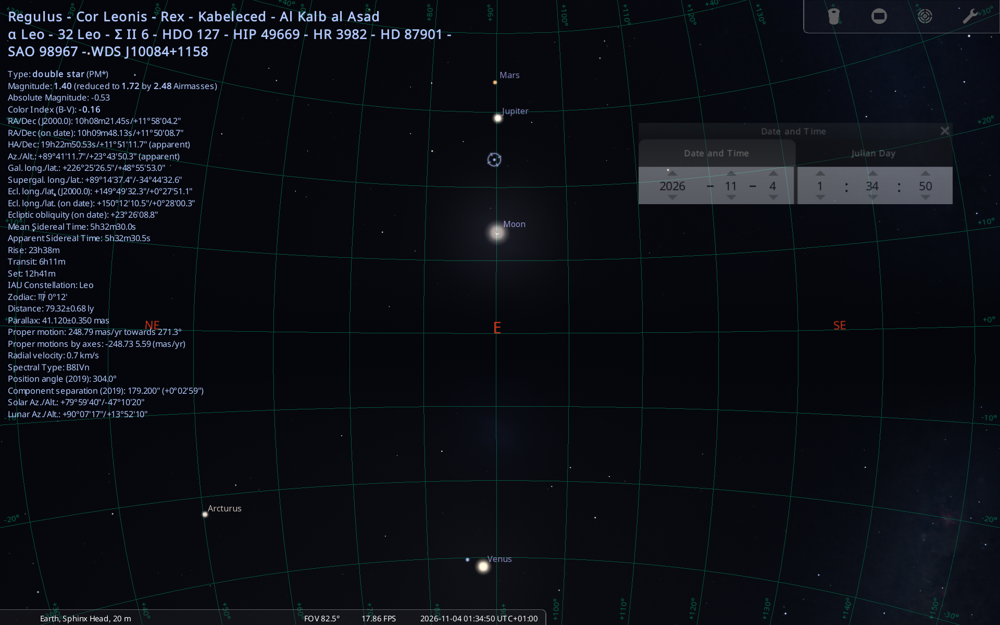

# 🦁 Project Regulus
**Advanced Archaeoastronomical Alignment, Deep-Time Chronology Engine**


Project Regulus is a high-performance, data-driven archaeoastronomy engine designed to compute complex celestial alignments and multi-planetary resonance events across millennia. By combining high-fidelity ephemeris calculations (NASA DE441) with an optimized multi-processing architecture, the tool allows researchers to verify celestial mechanics from deep antiquity (e.g., the mythical *Zep Tepi* epoch) up to modern orbital anomalies.

### 🔭 Physics & Prophecy Logic
The engine decodes the structural alignment criteria inspired by historical and modern accounts of celestial prophecy, notably the event framework:
> *"When the red star of Regulus aligns just before dawn in the gaze of the Sphinx, a new knowledge shall come into the world."*

**1. "The Red Star" (Atmospheric Extinction & Rayleigh Scattering)**
Regulus at ~7.5° altitude triggers the "Red Star" phase. The engine implements Rayleigh scattering models to calculate the spectral shift based on airmass ($X$). At this ultra-low altitude, the light of the B-type blue-white star Regulus is filtered through dense layers of the atmosphere, resulting in a distinct reddish spectral shift:

$$X = \frac{1}{\sin(\text{altitude})}$$

$$\Delta(B-V) \approx 0.15 \times X$$

**2. "Gaze of the Sphinx" (Geodetic Anchor)**
The script enforces a strict architectural constraint for the target monument:
**Azimuth = 90.0° (True East)**

**3. "Just Before Dawn" (Timing & Luminosity Windows)**
* **Dawn Start (Civil Twilight):** Officially begins when the Sun reaches exactly **-6.0°**.
* **The "Just Before Dawn" Target (-6.5°):** Calibrated to **-6.5°** to capture the exact moment immediately preceding actual dawn. At Giza's latitude, the Sun takes approximately 2.5 to 3 minutes to travel this 0.5° difference. 
* **The Azimuth Lock Constraint:** This 2-3 minute window is critical. The Earth rotates at roughly 1° every 4 minutes. If you wait for the Sun to rise higher, Regulus will have already drifted ~0.5° to 0.7° away from the precise 90.0° Sphinx alignment. The "Just Before Dawn" condition is therefore a highly fleeting, precise temporal lock.
* **Washout Limit (-2.72°):** The empirical threshold where sky background luminance ($B_{sky}$) mathematically overrides stellar flux ($F_{star}$), making the star invisible to the naked eye.

---

### 📂 Repository Architecture & The Engines

This repository is divided into three logical pipelines. Each directory contains specialized Python engines and raw CSV logs for verification.

#### 1. 📁 `Zep_Tepi` (Mythbusters Pipeline)
Designed to computationally verify or debunk the "First Time" (Zep Tepi) alignments proposed by authors like Graham Hancock and Robert Bauval for the ~10,500 BCE epoch.
* `ZepTepi_Orion_Nadir_Test.py` - Calculates the absolute minimum altitude (nadir) of Orion's Belt (Alnilam) across a 6,000-year sweep to verify if the 9.33° architectural target was ever mathematically achieved.
* `ZepTepi_Orion_Nadir_Results.csv` - The raw data export from the 6,000-year nadir scan, mathematically proving Orion's highest peak missed the 9.33° target.
* `ZepTepi_Regulus_TrueEast_Test.py` - Analyzes the second pillar of the theory. Using an optimized two-step processing sequence, it scans a hyper-focused 1,000-year window (-11,000 to -10,000 BCE) to determine if Regulus ever achieved a perfect 0.0° altitude while crossing the 90.0° (True East) azimuth in front of the Sphinx.
* `ZepTepi_Regulus_TrueEast_Results.csv` - The raw data export containing the 1,000-year deep scan logging planetary and stellar alignments (including Orion's Belt) during the Regulus rising phase.

#### 2. 📁 `Pillar_Of_Light_2026` (Modern Resonance Detection)
Built to analyze complex, multi-planetary gravitational alignments interacting with the Sphinx's 90.0° axis in the modern era.
* **The Engines:**
  * `Pillar_Epoch_Scanner_16k_Years.py` - A macro-sieve engine scanning 16,000 years of orbital mechanics (-13,000 BCE to +3,000 CE) at a coarse resolution, hunting for massive planetary clustering events around the True East axis. 
  * `Pillar_Precision_Scoring_Engine.py` - The "Sniper" script. It takes anomalies detected by the macro-sieve and re-scans them at minute-level resolution, ranking the gravitational lock (Total Deviation Score) of 5 celestial bodies.
  * `Pillar_Global_Monuments_Sync.py` - A multi-site control scanner running identical criteria against global megaliths (Angkor Wat, Stonehenge, Teotihuacan, Chichén Itzá) to mathematically prove geodetic exclusivity.
* **Control Data (The Skeptic's Shield):**
  * `Control_4th_Dynasty_2590_2500_BCE.csv` - Proves the "Pillar of Light" alignment did not exist during the construction of the Giza Pyramids.
  * `Control_Modern_Era_1_to_2000_CE.csv` - Proves the alignment is not a routine occurrence in the Common Era.
  * `Control_Baseline_2020_2032.csv` - Proves 2026 is an extreme anomaly even within its own decade.
* **2026 Anomaly Logs:**
  * `Pillar_Precision_Giza_2026.csv` & `Pillar_Global_Monuments_Sync_2026.csv`

#### 3. 📁 `The_Lion_Prophecy_Visuals`
Dedicated to the visual and atmospheric verification of the September 2026 alignment.
* `Regulus_Visual_Prophecy_September_Lock.py` - A high-speed, lightweight scanner simulating Rayleigh scattering and atmospheric visibility during the September sunrise window.
* `Regulus_RedStar_September_Visuals_20260714_001744.csv` - Raw log output verifying the timing of the Red Star phase vs. Geodetic lock.

---

### 🛑 Key Findings 1: Debunking the "Zep Tepi" Myth (10,500 BCE)
Proponents of the "First Time" theory (e.g., Robert Bauval, Graham Hancock) claim that around 10,500 BCE, a perfect celestial alignment occurred: Orion reached its absolute nadir (9.33°) while Leo (Regulus) rose exactly Due East (90.0°) in front of the Sphinx. 

The `Zep_Tepi` Mythbuster pipeline mathematically dismantles this claim using NASA DE441 ephemerides:
1. **The Orion Failure:** The absolute nadir of Orion's Belt during this epoch missed the required 9.33° mark by over a full degree. In archaeoastronomy, a 1° error equates to two full Moon diameters—a catastrophic failure for any "perfect" architectural alignment.
2. **The Regulus Failure:** High-precision scans of the 1,000-year window (-11,000 to -10,000 BCE) prove that Regulus did not achieve a perfect 0.0° horizon altitude while crossing the 90.0° True East azimuth.
    
**Conclusion:** The 10,500 BCE alignment is a mathematical fiction. The geometric perfection required by the theory never occurred, proving the alignment is a product of reverse-engineered theory rather than historical reality.

---

### 🏆 Key Findings 2: The Modern 2026 Alignment Trigger

The data mathematically proves that late 2026 hosts an extraordinarily rare synchronization of atmospheric optics and multi-planetary orbital resonance.

| Date | Phase | Astronomical Description |
| :--- | :--- | :--- |
| **Sept 24, 2026** | **Red dawn** | Validates the "Red Star.." Regulus 4° condition & a perfect **-6.5°** sun altitude with an incredible **0.0100°** deviation. ..just before dawn in the gaze of the sphinx" |
| **Nov 4, 2026** | **The Pillar of Light** | The mechanical lock. A 5-body vertical pillar (Mars, Jupiter, Moon, Regulus) strikes exactly **90.0°** azimuth. Venus anchors the underworld at **-30.5°**. The Sun is completely off-axis, proving geometric purity. |



---

### 📊 Empirical Proof: The Mars Resonance Baseline
To prove these alignments aren't random occurrences, the engine mapped a multi-year baseline tracking the synchronization error of Mars and Regulus hitting the 90.0° Sphinx azimuth:

| Epoch | Resonance Phase | Divergence Error (`Mars_Delta_Sec`) | System Status |
| :--- | :--- | :--- | :--- |
| **Oct 2024** | Mechanical Echo | ~ 4,723s *(> 1h 18m)* | ❌ Complete failure of alignment |
| **Nov 2026** | **Primary Lock** | **< 23 seconds** | ✅ **Near-perfect geodetic lock** |
| **Oct 2030** | Orbital Decay | ~ -769s *(~ 13m)* | ❌ Machinery shifting out of tune |

The precise 23-second multi-planetary vertical lock is mathematically exclusive to the specific coordinates and the 90.0° orientation of the Giza Plateau.

---

### 🌍 Global Control Scans (Raw Data)
To verify the geographic uniqueness of the November 2026 alignment, a multi-site control scan was executed against other megalithic structures (Angkor Wat, Stonehenge, Chichén Itzá, Teotihuacan). 

The raw CSV export is available in the `Pillar_Of_Light_2026` directory. The data conclusively demonstrates that the precise 23-second multi-planetary vertical lock is mathematically exclusive to the specific coordinates and the 90.0° orientation of the Giza Plateau.

---

### 🎛️ Configuration & Ephemeris
All critical controls are located at the top of the files in the `GLOBAL USER INPUT ZONE`:
* `TARGET_YEARS`: List or range of years to scan (e.g., `range(-13000, -8000)` or `[2026]`).
* `TARGET_SITES`: Define `NAME`, `LAT`, `LON`, `ELEVATION`, `AZIMUTH`, and `TZ`.
* `TIME_STEP_SECONDS`: Coarse step size for the Macro phase (300s recommended).

**Ephemeris Selection (NASA JPL):**
* `de421.bsp` *(Default)*: Covers 1900 – 2053. Lightweight file optimized for modern era testing.
* `de422.bsp`: Covers -3000 – 3000. Balanced precision kernel ideal for Classical antiquity research.
* `de431.bsp`: Covers -13200 – 17000. Extended history baseline for Paleolithic alignments.
* `de441.bsp` *(Production Default)*: High-precision long-term ephemeris covering **-13,200 BCE to +17,191 CE**. Highly recommended for avoiding multi-body orbital drift during deep history and Zep Tepi simulations.

---

### 🛠️ Default Settings Rationale
* **Azimuth 90.0°:** The geodetic anchor for the Sphinx's True East orientation.
* **RED_STAR_ALT (7.5°):** The critical altitude where Rayleigh scattering increases significantly. While Regulus is naturally blue-white, observation at this low angle—especially in the presence of aerosols, desert dust, or high humidity—intensifies light scattering, shifting the hue to a deep reddish-orange or "blood-red."
* **Sun Altitude -6.5°:** Custom threshold for the pre-dawn window; ensures the alignment occurs in the deeper pre-dawn phase before civil twilight.
* **Sun Altitude -2.72° (Washout Limit):** Empirical threshold where sky background luminance overrides stellar flux.

### 🚀 Quick Start & Reproduction

**1. Environment Setup**
Ensure you have **Python 3.10+** installed on your system. You can also execute these scripts in a Jupyter Notebook or Google Colab environment.

**2. Install Dependencies**
Open your terminal or command prompt and install the required astronomical and data science libraries:
```bash
pip install skyfield numpy pandas tqdm
```

**3. Download SPICE Kernels (Crucial Step)**
The engine relies on high-precision orbital data from NASA JPL to calculate exact historical and future planetary positions. You must download an ephemeris file (`.bsp`) and place it directly in the project root directory alongside the scripts.
*   **For Deep History (Zep Tepi Pipeline):** Download `de441.bsp`. This kernel covers -13,200 BCE to +17,191 CE. *(Warning: Due to the massive timescale, this file is ~3GB in size).*
*   **For Modern Scans (2026 Pillar Pipeline):** Download `de421.bsp`. This lightweight kernel covers the years 1900 to 2053 and is highly optimized for fast execution.
*   *Note:* Ephemeris files can be downloaded directly from the official NASA NAIF (Navigation and Ancillary Information Facility) server.

**4. Execute the Engines**
Navigate to the specific pipeline directory in your terminal and run the desired script. For example, to run the modern resonance scoring engine:
```bash
cd Pillar_Of_Light_2026
python Pillar_Precision_Scoring_Engine.py
```

**5. Analyze the Output**
The scripts are designed to automatically compile and export timestamped `.csv` files into their respective directories upon completion. You can open these datasets in Excel, Pandas, or any analytical software to review the exact orbital deviations, temporal locks, and geodetic scoring.
