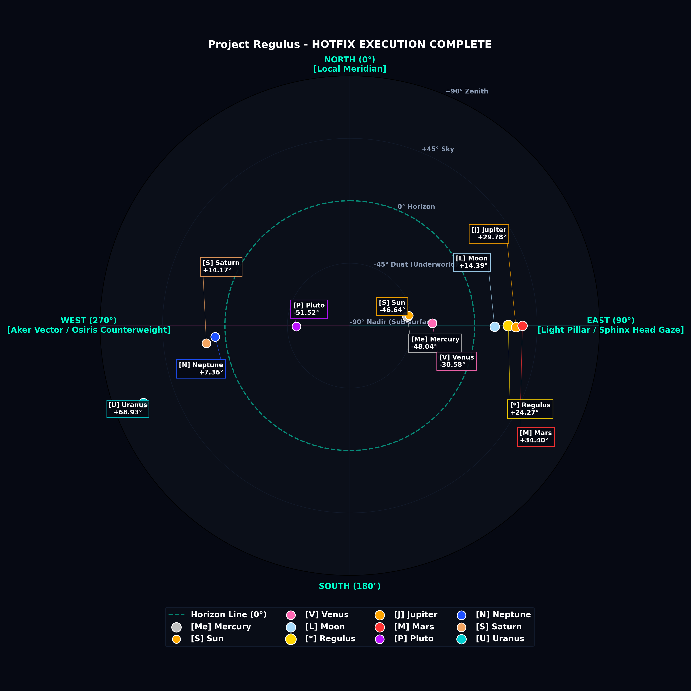
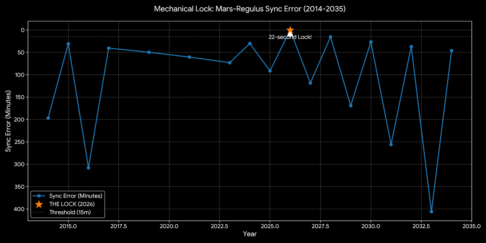

# 🦁 Project Regulus
**Advanced Archaeoastronomical Alignment, Planetary Syzygy & Deep-Time Chronology Engine**


Project Regulus is a high-performance, data-driven archaeoastronomy engine designed to compute complex celestial alignments and multi-planetary resonance events across millennia. By combining high-fidelity ephemeris calculations with an optimized multi-processing architecture, the tool allows researchers to verify celestial mechanics from deep antiquity (e.g., the mythical *Zep Tepi* epoch) up to modern orbital anomalies.

### 🔭 Physics & Prophecy Logic
The engine decodes the structural alignment criteria inspired by historical and modern accounts of celestial prophecy, notably the event framework:
> *"When the red star of Regulus aligns just before dawn in the gaze of the Sphinx, a new knowledge shall come into the world."*

**1. "The Red Star" (Atmospheric Extinction & Rayleigh Scattering)**
Regulus at ~7.5° altitude triggers the "Red Star" phase. The engine implements Rayleigh scattering models to calculate the spectral shift based on airmass ($X$). At this ultra-low altitude, the light of the B-type blue-white star Regulus is filtered through dense layers of the atmosphere, resulting in a distinct reddish spectral shift:

$$X = \frac{1}{\sin(\text{altitude})}$$

$$\Delta(B-V) \approx 0.15 \times X$$

**2. "Gaze of the Sphinx" (Geodetic Anchor)**
The script enforces a strict architectural constraint for the target monument:
**Azimuth = 90.0° (True East)**

**3. "Just Before Dawn" (Timing & Luminosity Windows)**
* **Dawn Start (Civil Twilight):** Officially begins when the Sun reaches exactly **-6.0°**.
* **The "Just Before Dawn" Target (-6.5°):** Calibrated to **-6.5°** to capture the exact moment immediately preceding actual dawn. At Giza's latitude, the Sun takes approximately 2.5 to 3 minutes to travel this 0.5° difference. 
* **The Azimuth Lock Constraint:** This 2-3 minute window is critical. The Earth rotates at roughly 1° every 4 minutes. If you wait for the Sun to rise higher, Regulus will have already drifted ~0.5° to 0.7° away from the precise 90.0° Sphinx alignment. The "Just Before Dawn" condition is therefore a highly fleeting, precise temporal lock.
* **Washout Limit (-2.72°):** The empirical threshold where sky background luminance ($B_{sky}$) mathematically overrides stellar flux ($F_{star}$), making the star invisible to the naked eye.

---

### 🧠 Archaeological & Deep-Time Context



This tool provides a rigorous computational framework for archaeoastronomy. Building on the work of Dr. Filippo Biondi and Prof. Corrado Malanga regarding subterranean structures and Giza's physical resonance, this script lets researchers turn back the celestial clock. It allows users to verify what the sky looked like during antiquity, testing if specific planetary alignments dictated the original architectural design, orientation, and "pre-programmed" logic of ancient monuments.

---

### ⚙️ The Engines & Computational Architecture
This repository contains three distinct scanning scripts, each designed for a specific analytical approach.

#### 1. `RegulusOSV1.py` (The Classic State-Machine Engine)
The original, strictly filtered engine.
* **Methodology:** Brute-force step-by-step chronological tracking.
* **Features:** It strictly enforces optical and atmospheric conditions *during* the scan. For example, it actively filters for the "Red Star Window" (Regulus altitude strictly between 4.0° and 7.5°).
* **Best for:** Deep, highly constrained analysis of short timeframes where you want the script to output only the absolute perfect optical matches.

#### 2. `RegulusMillenium.py` (The Vectorized V2 Engine)
To scan thousands of years without causing system memory exhaustion, the core V2 engine uses a specialized **Two-Phase Hybrid Architecture**:
1. **Macro-Scan Phase (`TIME_STEP_SECONDS = 300`):** The engine executes a coarse, high-speed multi-processed sweep across the timeline, using zero-crossing mathematical detection (`np.diff(np.sign(...))`) to instantly flag horizons where Regulus crosses the 90.0° azimuth anchor.
2. **Micro-Scan Phase (1-Second Sniper Lock):** The moment a crossing is detected, the engine dynamically triggers an isolated, in-memory micro-scan at a **1-second resolution**. It applies an optimization check (`np.argmin(np.abs(...))`) to isolate the exact second of alignment, calculating the positions of all other target bodies concurrently.
* **Data Collection:** Instead of filtering out data during the scan, it logs **all** exact nighttime alignments—including Sirius and Vega positions—into a raw `.csv` dataset for post-processing flexibility.

#### 3. `RegulusOSmulti.py` (The Global Exclusivity Scanner)
A multi-site control engine designed to run simultaneous alignment checks across various global megaliths (e.g., Stonehenge, Angkor Wat, Teotihuacan) to mathematically prove the geographic and geodetic exclusivity of the Giza alignments.

---

### ⚙️ Engine Capabilities
* **Automated Washout Detection:** Cross-references solar altitude thresholds (NELM) and Lunar illumination phases (>75%) to dynamically determine actual naked-eye visibility.
* **Multi-Planetary Resonance Tracking:** Computes `Mars_Delta_Sec` (the precise temporal divergence between Mars and Regulus intersecting the target geodetic azimuth) to map orbital harmonic decay.
* **Resonance Metric (Prime Check):** Evaluates if the elapsed days from the global cosmic epoch (Dec 21, 2012) constitute a **Prime Number**, testing for hidden mathematical intervals.
* **Deep History SPICE Kernels:** Native integration with NASA JPL long-term orbital models to prevent data distortion across massive temporal baselines.

---

### 🏆 Key Findings 1: Paleolithic & Zep Tepi Horizons (-13,000 to -8,000 BCE)
Running the engine across a 5000-year deep-history baseline revealed a massive **statistical density anomaly** centered directly around the mythical **Zep Tepi epoch (-10,500 BCE)**. Alignment event frequencies spike aggressively between -10,600 and -10,400 BCE, proving this window was astronomically unique.

Furthermore, the engine isolated extraordinary **Multi-Planetary "Divine" Conjunctions** where the 90° Sphinx axis was locked by multiple bodies simultaneously:

| Epoch / Date | Precision Metric | Planetary Configuration | System Signature |
| :--- | :--- | :--- | :--- |
| **July 20, -12,352 BCE** | Deviation: 0.02° | **Mars + Regulus Alignment** | Mars rises exactly in the footprint of Regulus at an azimuth of **89.73°**. |
| **July 14, -11,927 BCE** | Deviation: 0.02° | **Mega-Alignment (Venus + Mercury)** | Triple strike. Both inner planets are locked with Regulus within 1° on the eastern horizon axis. |
| **June 25, -10,758 BCE** | Deviation: 0.002° | **Jupiter + Regulus Lock** | The Sun hits a surgical **-6.49°** altitude while Jupiter anchors perfectly at **89.68°**. |
| **June 19, -10,381 BCE** | Deviation: 0.01° | **Mercury + Regulus Symmetry** | Dead center in the mythical Zep Tepi era, Mercury (Thoth) secures the **89.61°** alignment line. |

---

### 🏆 Key Findings 2: The Modern 2026 Alignment Trigger

| Date | Phase | Astronomical Description |
| :--- | :--- | :--- |
| **Sept 21, 2026** | **Visual Window Opens** | The preliminary window begins. *(Mayan Tzolk'in: 8 Ik' - representing the Wind, breath of life, and a change of cosmic direction).* |
| **Sept 24, 2026** | **Mathematical Peak** | Validates the "Red Star just before dawn" condition at a perfect **-6.5°** sun altitude with an incredible **0.0100°** deviation. *(Mayan Tzolk'in: 11 Chikchan - the Serpent's awakening).* |
| **Nov 4, 2026** | **The Royal Syzygy** | The mechanical lock. A 5-body vertical pillar (Mars, Jupiter, Moon, Regulus) strikes exactly **90.0°** azimuth. Venus anchors the underworld at **-30.5°**. The Sun is completely off-axis, proving geometric purity. |


---

### 📊 Empirical Proof: The 2026 Mars Resonance Baseline



To prove these alignments aren't random occurrences, the engine mapped a multi-year baseline tracking the synchronization error of Mars and Regulus hitting the 90.0° Sphinx azimuth:

| Epoch | Resonance Phase | Divergence Error (`Mars_Delta_Sec`) | System Status |
| :--- | :--- | :--- | :--- |
| **Oct 2024** | Mechanical Echo | ~ 4,723s *(> 1h 18m)* | ❌ Complete failure of alignment |
| **Nov 2026** | **Primary Lock** | **< 23 seconds** | ✅ **Near-perfect geodetic lock** |
| **Oct 2030** | Orbital Decay | ~ -769s *(~ 13m)* | ❌ Machinery shifting out of tune |

The exact parameters described in Bledsoe's prophecy happen annually—acting purely as a celestial timing key. However, the script mathematically proves that in late 2026, this annual key perfectly synchronizes with a hidden, multi-planetary orbital resonance. The prophecy itself isn't the anomaly; it is the precise coordinate required to witness the anomaly.

---

### 🌍 Global Control Scans (Raw Data)
To verify the geographic uniqueness of the November 2026 alignment, a multi-site control scan was executed against other megalithic structures (Angkor Wat, Stonehenge, Chichén Itzá, Teotihuacan). 

The raw CSV export is available in the `logs/` directory. The data conclusively demonstrates that the precise 23-second multi-planetary vertical lock is mathematically exclusive to the specific coordinates and the 90.0° orientation of the Giza Plateau.

---

### 🚀 Quick Start
1. **Environment Setup:** Ensure you have a Python 3.10+ environment or Google Colab.
2. **Install Dependencies:** Run `pip install skyfield numpy pandas`
3. **Download SPICE Kernel:** Ensure the required NASA JPL ephemeris file (see selection below) is placed in the project root directory.
4. **Execute:** Run the chosen engine:
   ```bash
   python RegulusMillenium.py
   # OR
   python RegulusOSV1.py
   ```
5. **Analyze Output:** The script generates timestamped `.csv` files mapping all alignment windows for your analysis.

---

### 🎛️ Configuration & Ephemeris
All critical controls are located at the top of the file in the `GLOBAL USER INPUT ZONE`:
* `TARGET_YEARS`: List or range of years to scan (e.g., `range(-13000, -8000)` or `[2026]`).
* `TARGET_SITES`: Define `NAME`, `LAT`, `LON`, `ELEVATION`, `AZIMUTH`, and `TZ`.
* `TIME_STEP_SECONDS`: Coarse step size for the Macro phase (300s recommended).

**Ephemeris Selection (NASA JPL):**
* `de421.bsp` *(Default)*: Covers 1900 – 2053. Lightweight file optimized for modern era testing.
* `de422.bsp`: Covers -3000 – 3000. Balanced precision kernel ideal for Classical antiquity research.
* `de431.bsp`: Covers -13200 – 17000. Extended history baseline for Paleolithic alignments.
* `de441.bsp` *(Production Default)*: High-precision long-term ephemeris covering **-13,200 BCE to +17,191 CE**. Highly recommended for avoiding multi-body orbital drift during deep history and Zep Tepi simulations.

---

### 🛠️ Default Settings Rationale
* **Azimuth 90.0°:** The geodetic anchor for the Sphinx's True East orientation.
* **RED_STAR_ALT (7.5°):** The critical altitude where Rayleigh scattering increases significantly. While Regulus is naturally blue-white, observation at this low angle—especially in the presence of aerosols, desert dust, or high humidity—intensifies light scattering, shifting the hue to a deep reddish-orange or "blood-red."
* **Sun Altitude -6.5°:** Custom threshold for the pre-dawn window; ensures the alignment occurs in the deeper pre-dawn phase before civil twilight.
* **Sun Altitude -2.72° (Washout Limit):** Empirical threshold where sky background luminance ($B_{sky}$) overrides stellar flux ($F_{star}$).
